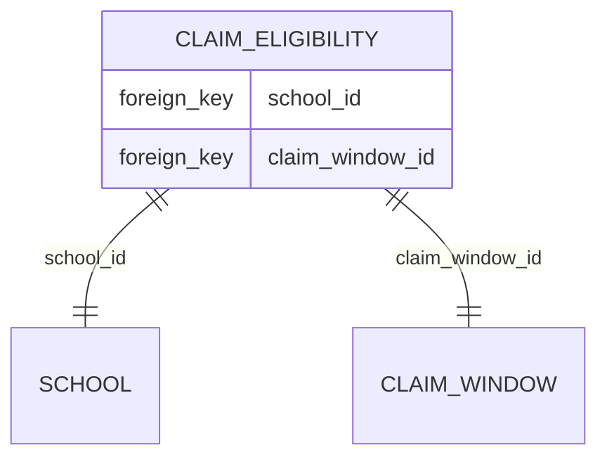

# 10. Onboarding claims schools

Date: 2024-07-10

## Status

Pending

## Context

Schools are able to claim for mentor funding through the claims service. A school who has not claimed before will be able to claim 20 hours of funding per mentor per accredited provider. If a school has claimed funding in the previous academic year for a specific mentor then they will only be able to claim 6 hours of funding for that mentor, for the same accredited provider. It is also possible that a school who took on mentors in a previous academic year has not done so in the current academic year, and in this case they will not be able to claim further funding.

We hold data about schools from other services within the BaT service line that can be provided as a CSV from the data and insights team. We want to utilise this data to ensure that only schools that are eligible to claim are able to do so.

## Decision

The process of checking school eligibility is manual, as there are no APIs available to check this data. A CSV is required to be uploaded to the service, this CSV will contain the URN of the schools that are eligible to claim. The service will then check the URN of the school that is claiming against the CSV, if the URN is present in the CSV then the school is eligible to claim for the current academic year. Within the application we track the academic year that claims are made via the claim window.

To track this I propose the following database schema:



The intention of the `claim_elibility` table is to store the relationship between a school and a claim window, this will allow us to track which schools are eligible to claim for a given academic year.

To populate this data we will add a new page to the support console that will allow anyone with access to the support console to upload the CSV from the data and insights team. After uploading this CSV a background job will be created that will read the CSV and populate the `claim_eligibility` table with the relevant data.

Once the data has been populated the service we will be able to identify which schools are eligible to claim for the current academic year with a simple query. For example:

```ruby
# This assumes we set up a `has_many :claim_eligibilities` relationship and a `has_many :claim_windows, through: :claim_eligibilities` relationship on the `Claims::School` model

claim_window = ClaimWindow.current
eligible_schools = Claims::School.joins(:claim_windows).where(claim_windows: { id: claim_window.id })

# From here we can send out invitation emails to the schools that are eligible to claim to onboard their users
```

We'll also need to consider schools who have previously used the service and ensure that they are restricted from creating new claims, this can be handled via the policies by checking if they have a valid `claim_eligibilitys` record.

## Consequences

If we implement these changes, only schools that have claim eligibility records will be able to create claims, this may cause issues if the data is not uploaded in a timely fashion. Additionally as this is a manual process (due to no automated way to get this data) we will also need to make the relevant people aware that this process needs to be completed.

- We will need to add a new page to the support console to allow the upload of the CSV
- We will need to add a new background job to read the CSV and populate the `claim_eligibility` table
- We will need to update the relevant policies to check if a school has a valid `claim_eligibility` record
