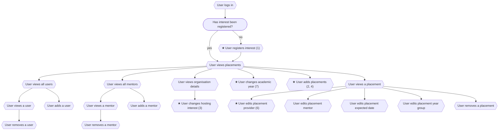
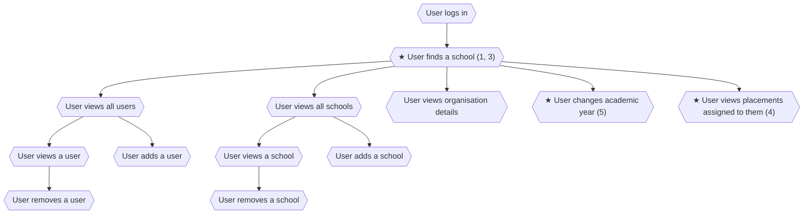

# Private Beta Features

## Schools

1. Add expression of interest flow
2. Add bulk adding placements
3. Add ability to update hosting interests
4. Add mixed year group option when creating placements
5. Remove the providers tab
6. Update the provider assignment for placements to be for any provider in the service
7. Add academic year switcher

## Providers

1. Add find a school page
2. Remove find placements page
3. Import data from the register service to show previously hosted placements for schools
4. Add ability to view placements that have been assigned to the provider
5. Add academic year switcher

