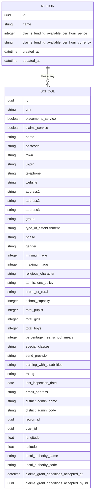

# School region calculations

Within the claims application, we have a need to calculate a schools funding per hour. This is so when a mentor completes their training we have a way to calculate their hourly rate, which they then can recoup.

```
  claims_funding_available_per_hour_pence = region.claims_funding_available_per_hour_pence

  total_hours_completed = claim.mentor_trainings.sum(:hours_completed)

  amount_in_pence = claims_funding_available_per_hour_pence * total_hours_completed
```

## Data model

We have a data model in place where a [School](https://github.com/DFE-Digital/itt-mentor-services/blob/main/db/schema.rb#L281) belongs to a [Region](https://github.com/DFE-Digital/itt-mentor-services/blob/main/db/schema.rb#L263), a Region can have many schools associated to it.



## Associating Schools to Regions

We have an overnight process which syncs across schools from GIAS, in this process it also does the associating of a School to a given Region. The way this is done is we use the Schools `district_admin_code` to define which Region it should go in. These are mapped out [here](https://github.com/DFE-Digital/itt-mentor-services/blob/main/app/services/concerns/regional_areas.rb) where each `district_admin_code` is related to a specific region.

## Calculating the hourly rate

Once all associating has taken place we can then query what the hourly rate will be by doing `school.region.funding_available_per_hour` [here](https://github.com/DFE-Digital/itt-mentor-services/blob/main/app/models/region.rb) which will then derive the funding per hour.
