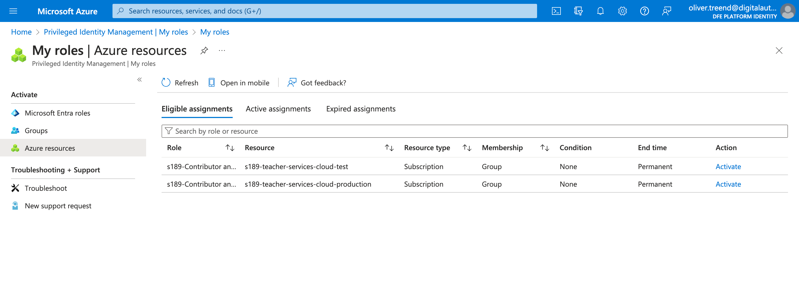
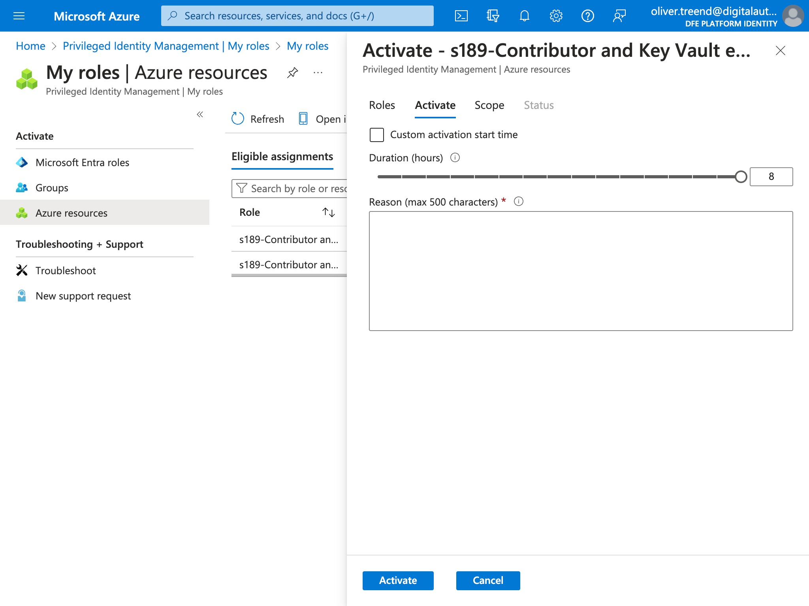

# Connect to an instance running in Azure

This Rails app runs on the [Teacher Services Cloud](https://github.com/DFE-Digital/teacher-services-cloud) Kubernetes infrastructure in Azure.

Follow these instructions to [run a Rake task](#run-a-rake-task) or [open a Rails console](#open-a-rails-console).

> [!NOTE]
> These instructions are for connecting to the `test` Kubernetes cluster which powers our **QA and PR review environments**.
>
> We don't have a production environment yet – but when we do, we should update these instructions accordingly.

## 1. Authenticate to the Kubernetes cluster

You need to grant yourself permission to access Azure resources in the test environment. This is a temporary grant – it'll expire after 8 hours, then you'll need to do it again.

1. Login to the [Microsoft Azure portal](https://portal.azure.com)

   > Use your `@digitalauth.education.gov.uk` account.
   >
   > Make sure it says "DfE Platform Identity" in the top right corner of the screen below your name. If not, click the settings/cog icon and choose it from the list of directories.

2. Go to [PIM > My roles > Azure resources](https://portal.azure.com/?feature.msaljs=true#view/Microsoft_Azure_PIMCommon/ActivationMenuBlade/~/azurerbac)

3. Find the resource named `s189-teacher-services-cloud-test` from the list.

   > You may need to widen the "Resource" column to see the full name.
   >
   > Alternatively type "test" into the search box to filter the list.
   >
   > 

4. Click "Active" on `s189-teacher-services-cloud-test`.

   > Enter a reason for needing access. For example, "Running a Rake task".
   >
   > Click the "Activate" button at the bottom of the pane.
   >
   > 

5. Open a console and run:

   ```
   $ cd ~/path/to/itt-mentor-services
   $ make qa get-cluster-credentials
   ```

6. Assuming everything worked correctly, you should now be able to access the Kubernetes cluster using the `kubectl` command.

## 2. Get the Kubernetes Deployment name

Multiple instances of the app run on the `test` cluster. There's one for the QA environment, and one for each Pull Request that has a `deploy` label. Each one is a Kubernetes [Deployment](https://kubernetes.io/docs/concepts/workloads/controllers/deployment/) resource.

To connect to the **QA environment**, the deployment name is:

```
itt-mentor-services-qa
```

To connect to a **review app**, the deployment is named after the PR number:

```
itt-mentor-services-[PR_NUMBER]
```

For example, PR #123 would be `itt-mentor-services-123`.

> [!TIP]
> For a list of all active deployments, run:
>
> ```
> $ kubectl -n bat-qa get deployments
> ```
>
> This will include other BAT apps because they all run in the same [Kubernetes namespace](https://kubernetes.io/docs/concepts/overview/working-with-objects/namespaces/).

## 3. Connect to a running container

These commands will connect to the QA environment. Change the deployment name accordingly for PR review apps.

### Open a Rails console

Open an interactive Rails console using this command:

```
$ kubectl -n bat-qa exec -it deployment/itt-mentor-services-qa -- rails console
```

### Open a shell console

Open an interactive Linux shell using this command:

```
$ kubectl -n bat-qa exec -it deployment/itt-mentor-services-qa -- sh
```

### Run a Rake task

Run Rake tasks using this command:

```
$ kubectl -n bat-qa exec -it deployment/itt-mentor-services-qa -- rake {name_of_task}
```

Or list all available Rake tasks with:

```
$ kubectl -n bat-qa exec -it deployment/itt-mentor-services-qa -- rake -T
```

# Useful links

- [Teacher Services Cloud documentation](https://github.com/DFE-Digital/teacher-services-cloud/tree/main/documentation)
- [Developer onboarding](https://github.com/DFE-Digital/teacher-services-cloud/blob/main/documentation/developer-onboarding.md) for the Teacher Services Cloud
- If in doubt, ask in the [#teacher-services-infra](https://ukgovernmentdfe.slack.com/archives/C011EM7HU85) Slack channel
