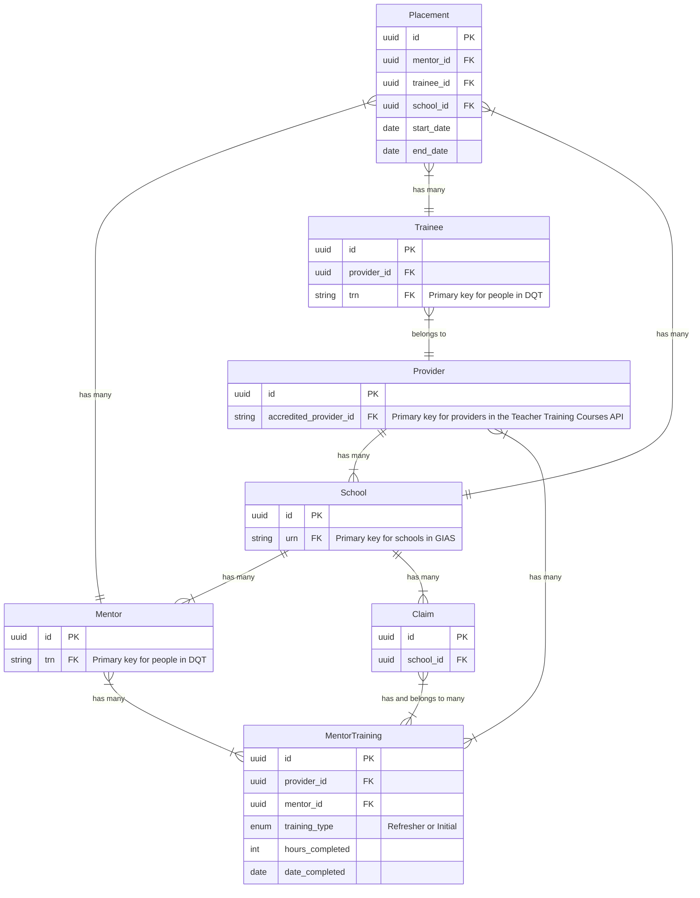

# Data model

> [!NOTE]
> This is a _draft_ document. It will change as we develop our understanding of the services that this application encapsulates.

This application will power two user-facing services: 'Manage school placements' and 'Claim funding for mentors' (a.k.a. Track & Pay). Some data entities will be used by both services – for example, Mentors, Providers and Schools. Others will only be relevant to one service – for example, Funding Claims and School Placements.

## Entity Relationship Diagram (ERD)

This diagram represents our current understanding of the data models that will exist within this application.

There are a few things to bear in mind when reading this:

- This diagram attempts to bridge the gap between a 'high level' list of entities, and a 'low level' database schema. It sits somewhere in between.
- It is incomplete. As we continue developing our services, this diagram will undoubtedly change and grow.

