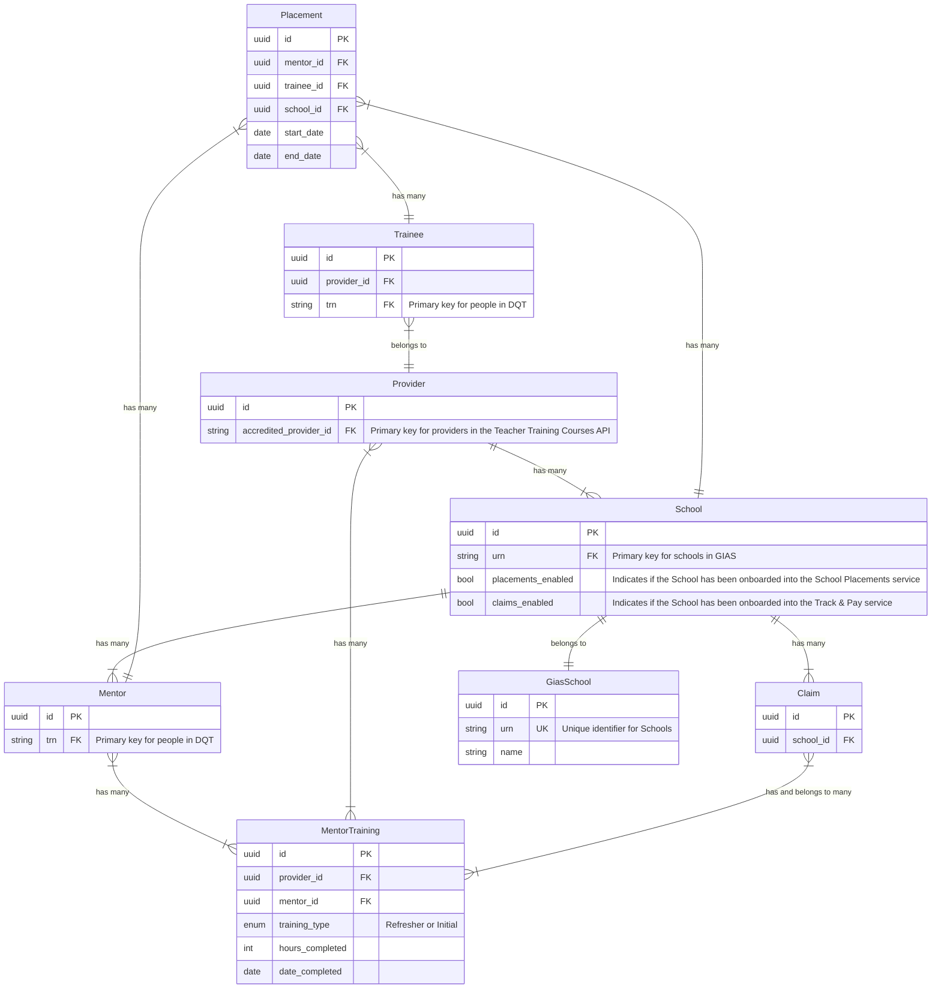

# Data model

> [!NOTE]
> This is a _draft_ document. It will change as we develop our understanding of the services that this application encapsulates.

This application will power two user-facing services: 'Manage school placements' and 'Claim funding for mentors' (a.k.a. Track & Pay). Some data entities will be used by both services – for example, Mentors, Providers and Schools. Others will only be relevant to one service – for example, Funding Claims and School Placements.

## Entity Relationship Diagram (ERD)

This diagram represents our current understanding of the data models that will exist within this application.

There are a few things to bear in mind when reading this:

- This diagram attempts to bridge the gap between a 'high level' list of entities, and a 'low level' database schema. It sits somewhere in between.
- It is incomplete. As we continue developing our services, this diagram will undoubtedly change and grow.

## Onboarding Schools and Providers into the services

Schools need to be onboarded by a support user before they can use either of the services. It's possible for a School to be onboarded into one service and not the other – for example, they could be onboarded into Track & Pay but not School Placements. This gives us the flexibility to run our respective private beta rollouts with different schools, if needed.

Additionally, Providers will need to be onboarded to use the School Placements service. Providers will not use Track & Pay, so will not need onboarding into that service.

### Schools

An 'onboarded' School will have a record in the `schools` table (the `School` entity in our ERD).

The `placements_enabled` and `claims_enabled` boolean attributes will indicate which service(s) the School has been onboarded into. It's possible for Schools to be onboarded to only one service, or both.

For example:

| urn | name | placements_enabled | claims_enabled |
| --- | --- | --- | --- |
| 100000 | School A | 1 | 0 |
| 100001 | School B | 0 | 1 |
| 100002 | School C | 1 | 1 |

- School A has only been onboarded into the School Placements service.
- School B has only been onboarded into the Track & Pay service.
- School C has been onboarded into both services.

If a School doesn't exist in the `schools` table, it hasn't been onboarded to either service yet.

**Note:** the `gias_schools` table will contain all known schools, regardless of whether they've been onboarded into a service.

### Providers

Onboarded Providers will have a record in the `providers` table.

Providers are only onboarded into the School Placements service, because this is the only service Provider Users will need to sign in to. Providers will not sign in to the Track & Pay service.

Both services will query the Provider endpoints on the [Teacher Training Courses API](https://api.publish-teacher-training-courses.service.gov.uk/docs/api-reference.html) to retrieve and display information about a Provider given its Accredited Provider ID.
