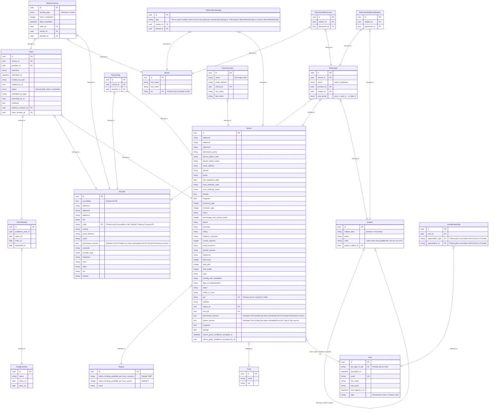

# Data model

> [!NOTE]
> This is a _draft_ document. It will change as we develop our understanding of the services that this application encapsulates.

This application will power two user-facing services: 'Manage school placements' and 'Claim funding for mentor training' (a.k.a. Track & Pay). Some data entities will be used by both services – for example, Mentors, Providers and Schools. Others will only be relevant to one service – for example, Funding Claims and School Placements.

## Entity Relationship Diagram (ERD)

This diagram represents our current understanding of the data models that will exist within this application.

There are a few things to bear in mind when reading this:

- This diagram attempts to bridge the gap between a 'high level' list of entities, and a 'low level' database schema. It sits somewhere in between.
- It is incomplete. As we continue developing our services, this diagram will undoubtedly change and grow.

## Onboarding Schools and Providers into the services

Schools need to be onboarded by a support user before they can use either of the services. It's possible for a School to be onboarded into one service and not the other – for example, they could be onboarded into Track & Pay but not School Placements. This gives us the flexibility to run our respective private beta rollouts with different schools, if needed.

Additionally, Providers will need to be onboarded to use the School Placements service. Providers will not use Track & Pay, so will not need onboarding into that service.

### Schools

All schools from the GIAS import will have a record in the `schools` table (the `School` entity in our ERD).

The `placements_service` and `claims_service` boolean attributes will indicate which service(s) the School has been onboarded into. It's possible for Schools to be onboarded to both services, one service, or neither service.

For example:

| urn    | name     | placements_service | claims_service |
| ------ | -------- | ------------------ | -------------- |
| 100000 | School A | 1                  | 0              |
| 100001 | School B | 0                  | 1              |
| 100002 | School C | 1                  | 1              |
| 100003 | School D | 0                  | 0              |

- School A has only been onboarded into the School Placements service.
- School B has only been onboarded into the Track & Pay service.
- School C has been onboarded into both services.
- School D is a school from the GIAS import, but it is not onboarded into either service

### Providers

The `providers` table will be populated with data sourced from the [Teacher Training Courses API](https://api.publish-teacher-training-courses.service.gov.uk/docs/api-reference.html). In its simplest form, this will serve as a 'lookup table' holding details of every known ITT Provider.

Onboarded Providers will have their `placements_service` field set to `true`.

Providers are only onboarded into the School Placements service, because this is the only service Provider Users will need to sign in to. Providers will not sign in to the Track & Pay service.

## Users and Organisations

Users are members of Organisations.

Organisation is a polymorphic association which represents either a School or a Provider.

A User belonging to a School in the Track & Pay service won't automatically be able to sign in to the School Placements service and manage Placements for that same School. They'll need to be added to the User list of each service independently if they need to access both.

Since the services will be on different hostnames, they will automatically have different session cookies. So it seems reasonable to consider Users as entirely independent within each service.

### Users

Users are scoped by `service`, which will be either `"placements"` or `"claims"`.

We can consider Users to have the unique composite index:

- `[service, email]`

### Memberships

Users can have many Memberships with Organisations (Schools or Providers). Membership acts as the join table between Users and Schools/Providers.

We can therefore define the following non-unique composite index:

- `[organisation_type, organisation_id]`
