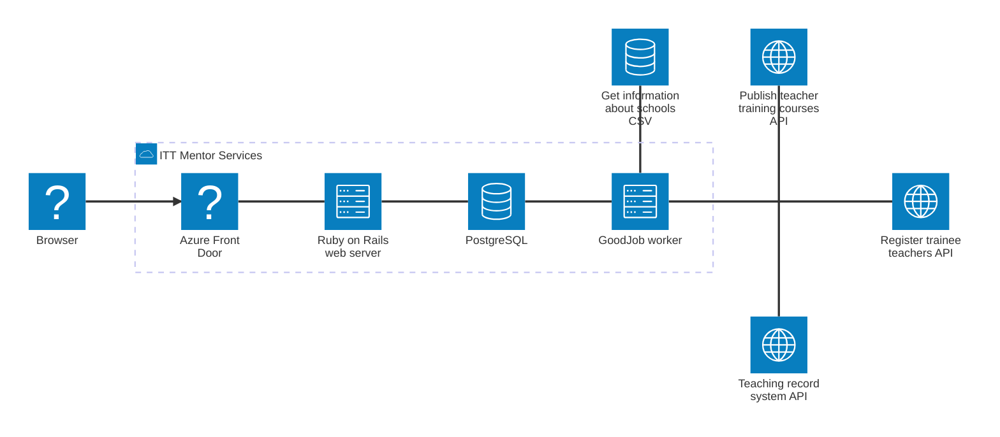

# Infrastructure Map

```mermaid
architecture-beta
  group app(cloud)[ITT Mentor Services]

  service app_server(server)[Ruby on Rails web server] in app
  service app_worker(server)[GoodJob worker] in app
  service azure_frontdoor(logos:microsoft-azure)[Azure Front Door] in app
  service db(database)[PostgreSQL] in app

  service register_server(internet)[Register trainee teachers API]
  service publish_server(internet)[Publish teacher training courses API]
  service trs_server(internet)[Teaching record system API]
  service gias_data(database)[Get information about schools CSV]

  service browser(material-symbols:computer-outline)[Browser]

  junction external

  azure_frontdoor:R -- L:app_server

  browser:R --> L:azure_frontdoor

  app_worker:L -- R:db
  app_server:R -- L:db

  app_worker:R -- L:external
  app_worker:T -- B:gias_data

  external:R -- L:register_server
  external:T -- B:publish_server
  external:B -- T:trs_server
```
